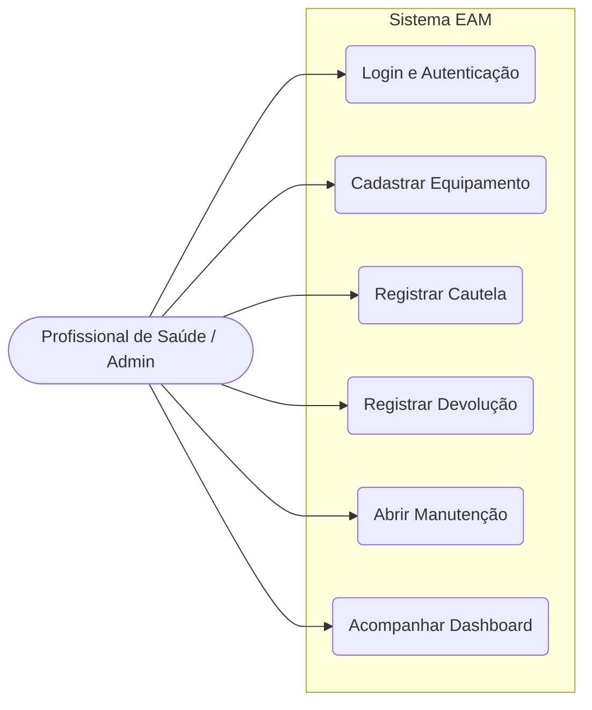
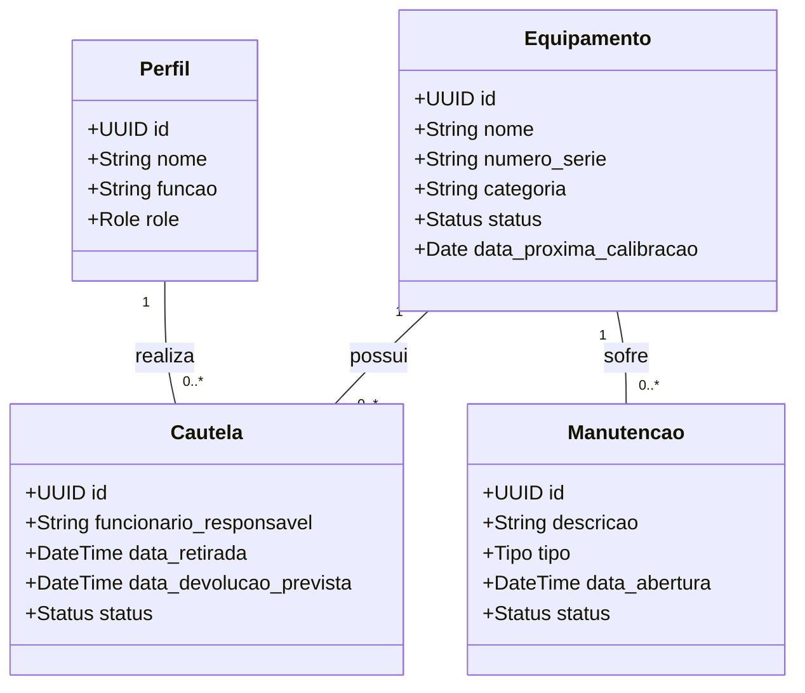
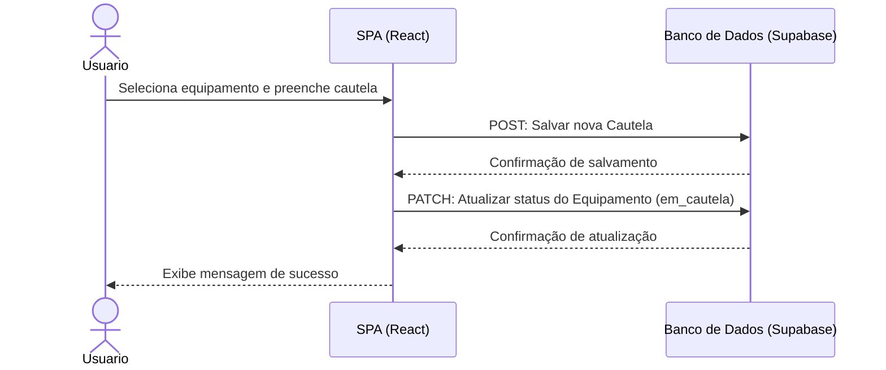
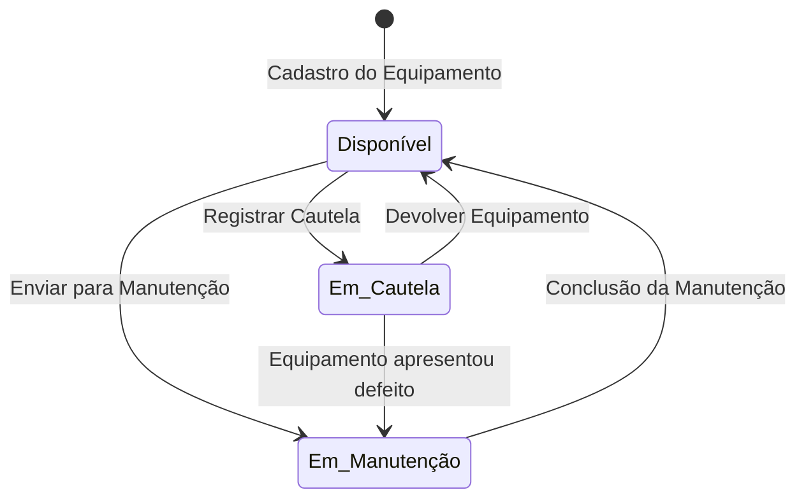
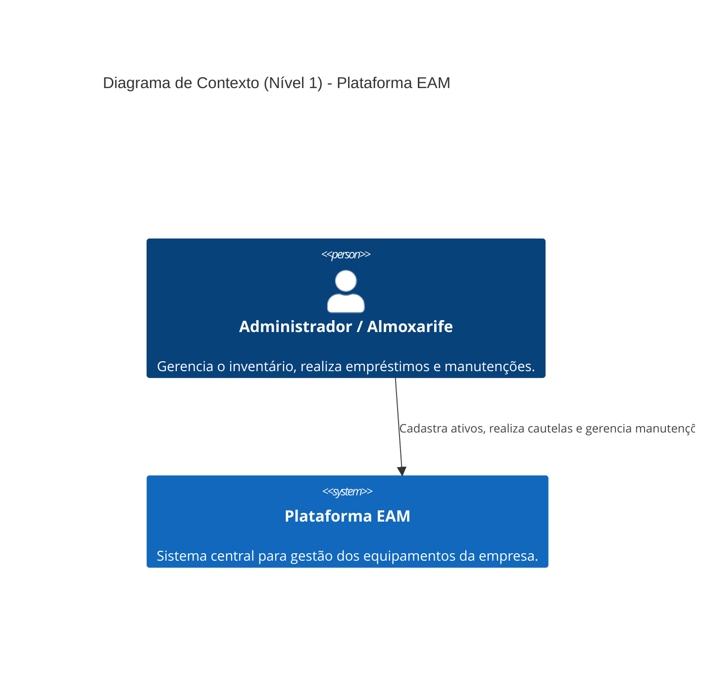
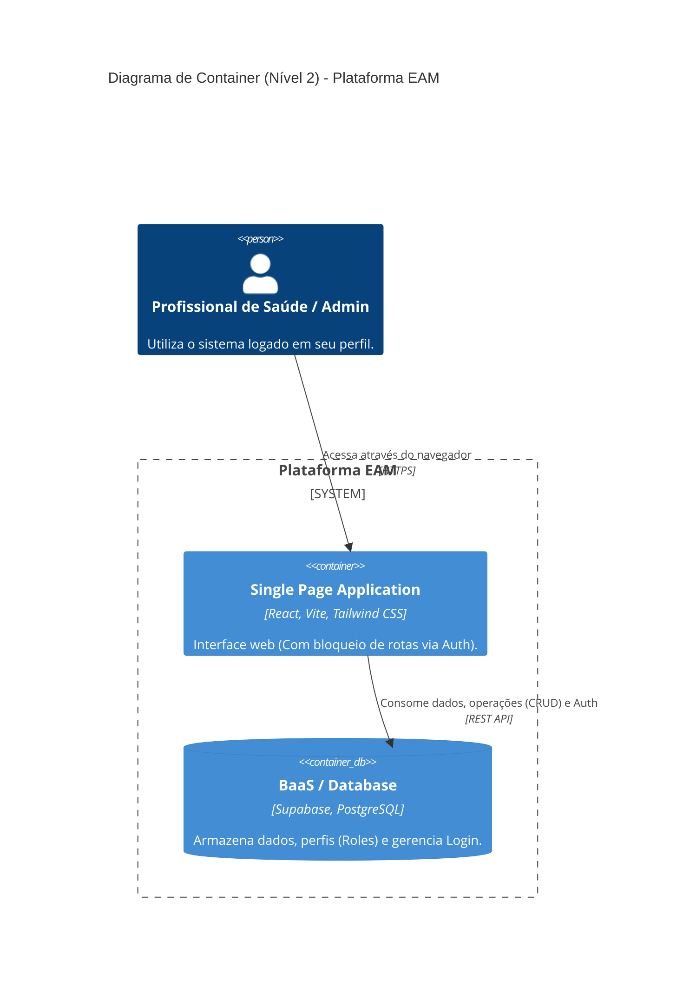

# 🛠️ Plataforma EAM (Enterprise Asset Management)

Sistema web para o gerenciamento de ativos corporativos, controle de cautelas (empréstimos) e gestão de manutenções preventivas e corretivas.

## 🚀 Tecnologias Utilizadas

- **Front-end:** React.js, TypeScript, Vite, Tailwind CSS
- **Back-end & Banco de Dados:** Supabase (PostgreSQL)

---

## 👥 Equipe do Projeto

*(Preencha com os nomes dos 4 a 5 integrantes da equipe e suas funções, conforme os requisitos da disciplina)*

- **[Nome do Integrante 1]** - Desenvolvedor Front-end -> UX/UI Designer
- **[Nome do Integrante 2]** - Desenvolvedor Back-end -> Banco de Dados
- **[Nome do Integrante 3]** - Arquiteto de Software -> Analista de Requisitos
- **[Nome do Integrante 4]** - Gerente de Produtos -> Scrum Master
- **[Cesajulio]** - [Sua Função]

---

## 📢 Build in Public

Acompanhe nossa jornada de desenvolvimento do software nas redes sociais:

- [Post da Semana 1 - Instagram/LinkedIn](#)
- [Post da Semana 2 - Instagram/LinkedIn](#)
- [Post da Semana 3 - Instagram/LinkedIn](#)

---

## 📂 Entregáveis da Disciplina

Para a avaliação AV1, seguem as documentações exigidas nas semanas iniciais:

- **Semana 1:** [Link para o Protótipo no Figma](#) | Modelagem de Banco de Dados (ver `supabase_schema.sql`)
- **Semana 2:** [Planejamento de Custos](docs/custos.md) | Diagramas UML e C4 (Abaixo)
- **Semana 3:** [Link para o Organograma](#) | [Link para o Plano de Carreira](#)

---

## 📐 Diagramas UML

### Diagrama de Casos de Uso
Representa as interações principais entre os atores e o sistema.

### Diagrama de Classes
Entidades principais do sistema (baseado na modelagem do banco de dados).

### Diagrama de Sequência (Fluxo de Cautela)

### Diagrama de Atividade (Ciclo do Equipamento)

---

## 🏗️ Diagramas C4 Model

### Diagrama de Contexto (Nível 1)

### Diagrama de Container (Nível 2)

