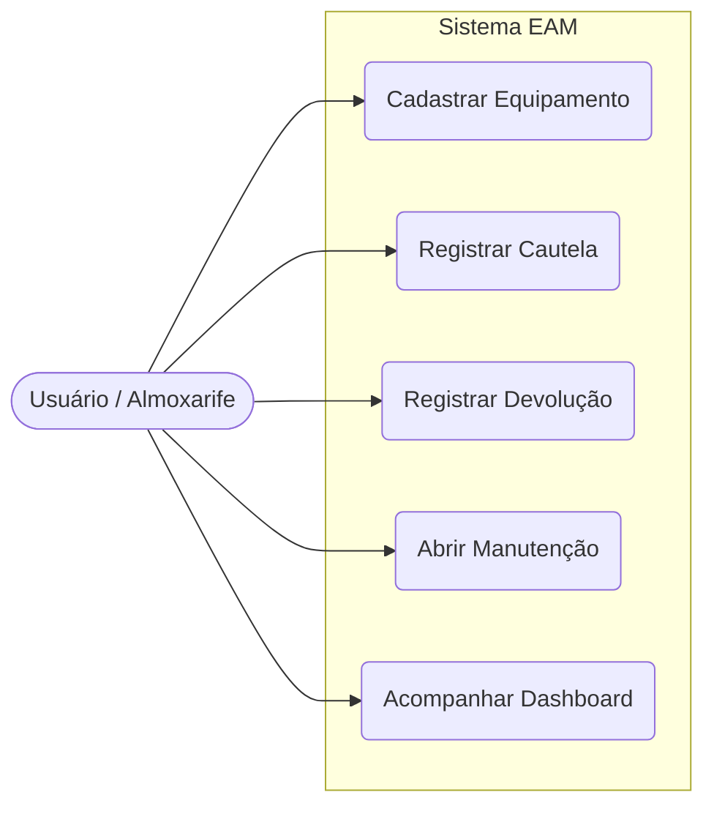
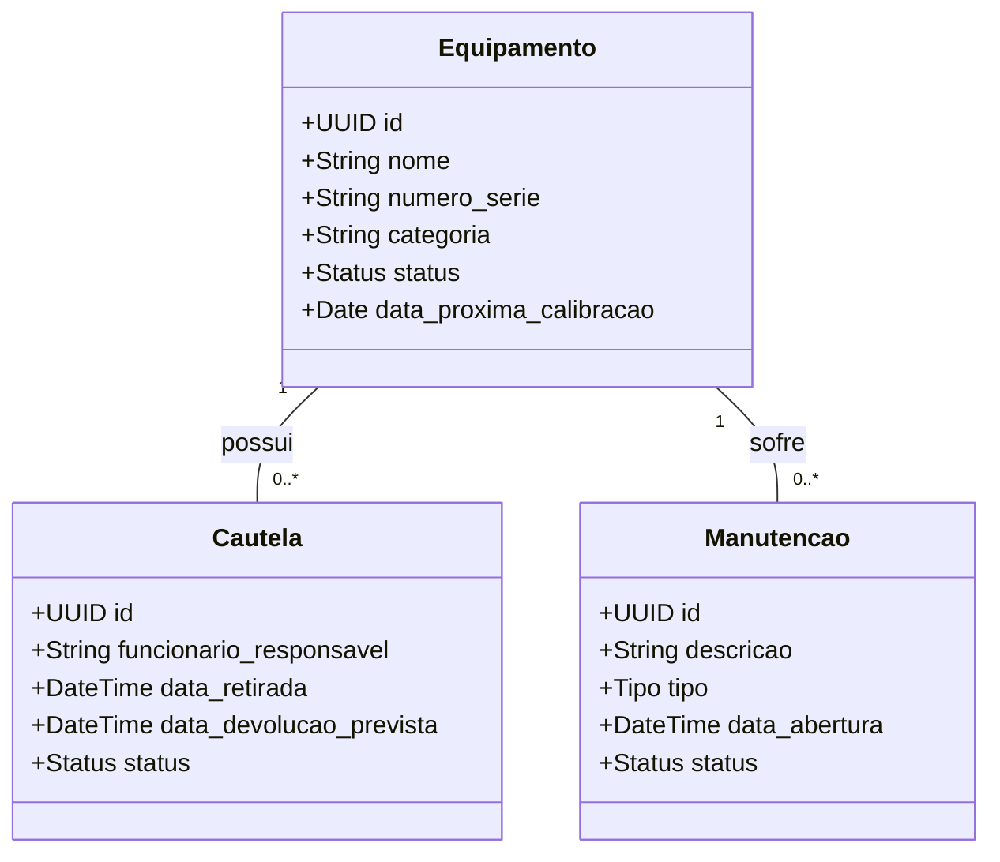
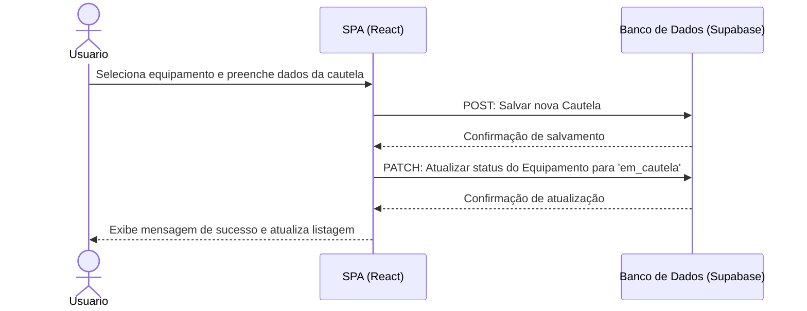
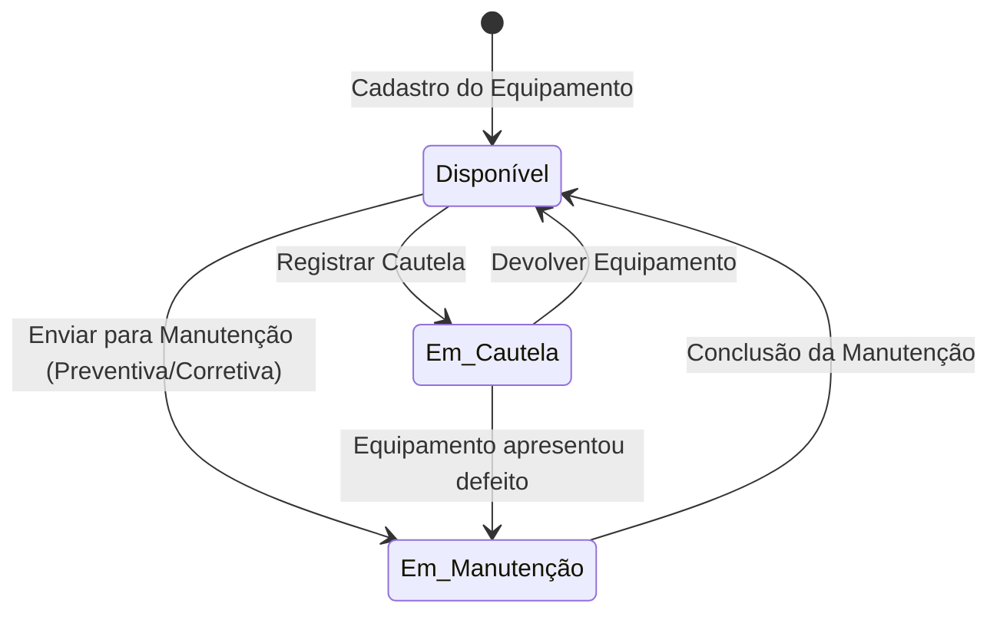
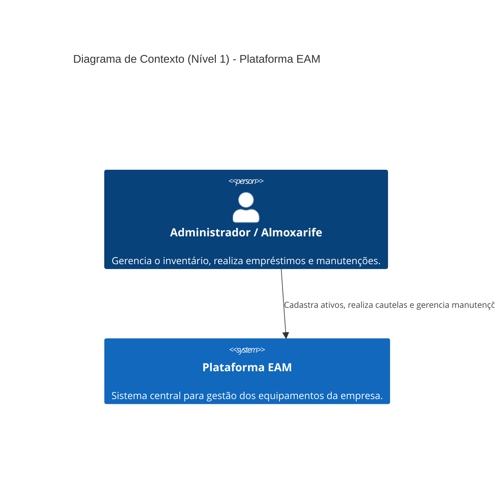
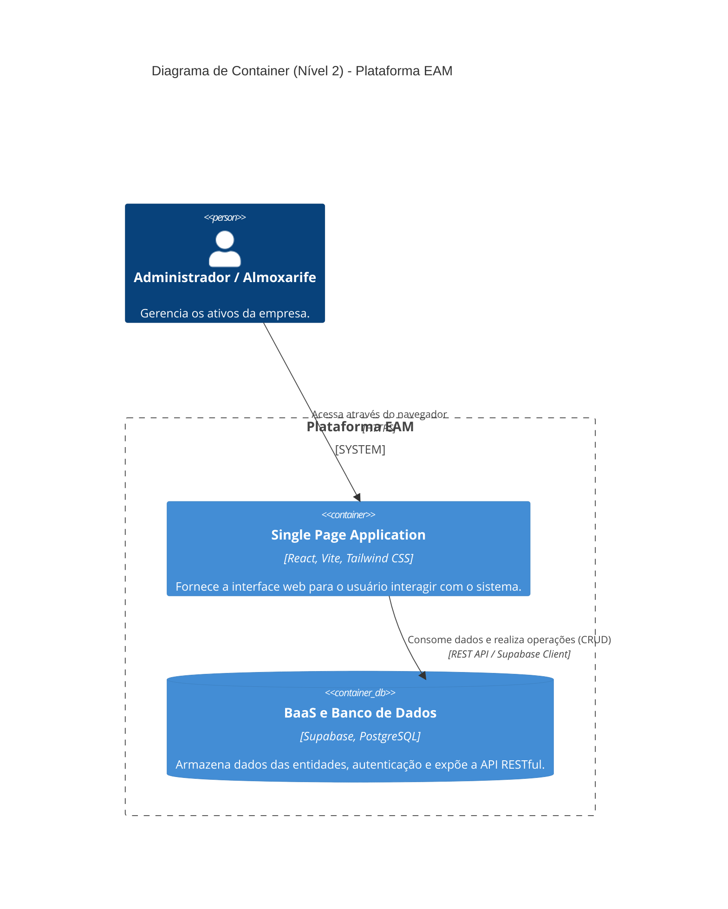

# Diagramas do Projeto EAM

Este documento contém os diagramas arquiteturais e UML do sistema de gerenciamento de ativos (EAM), conforme exigido para a documentação do projeto.

---

## 1. Diagramas UML

### 1.1 Diagrama de Casos de Uso
Representa as interações principais entre os atores e o sistema EAM.

### 1.2 Diagrama de Classes
Demonstra as entidades principais do sistema e seus relacionamentos (baseado no esquema de banco de dados).

### 1.3 Diagrama de Sequência (Fluxo de Cautela)
Detalha o fluxo de comunicação para o empréstimo (cautela) de um equipamento.

### 1.4 Diagrama de Atividade (Ciclo de Vida do Equipamento)
Mostra o fluxo de estados pelos quais um equipamento passa no sistema.

---

## 2. Diagramas C4 Model

### 2.1 Diagrama de Contexto (Nível 1)
Visão de alto nível de como o usuário interage com o sistema.

### 2.2 Diagrama de Container (Nível 2)
Visão arquitetural demonstrando a separação do Front-end (React) e Back-end as a Service (Supabase).

